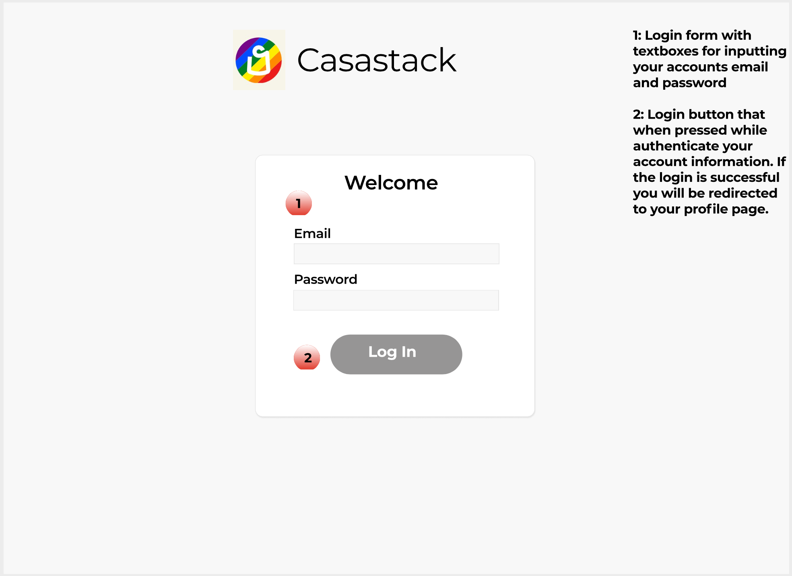
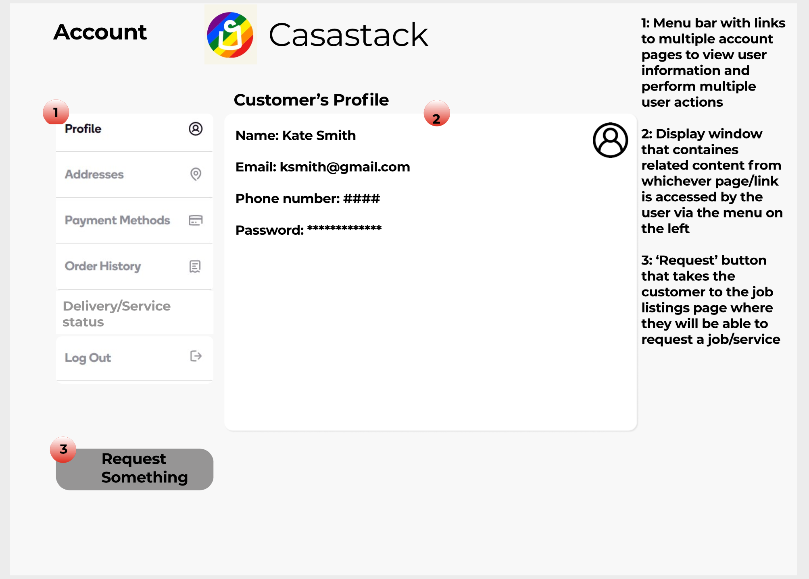
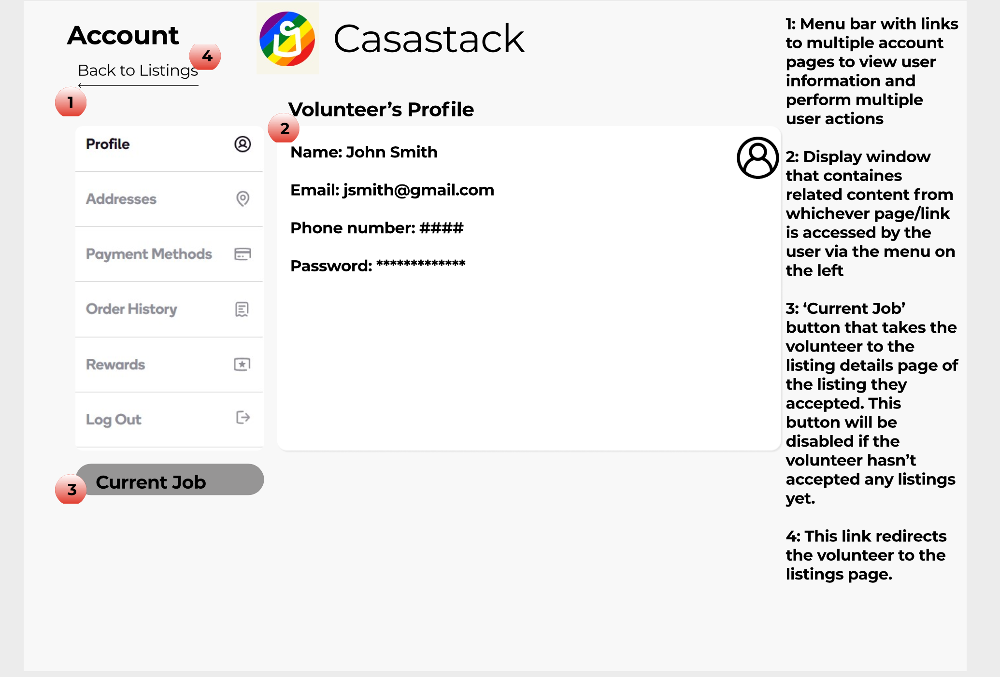
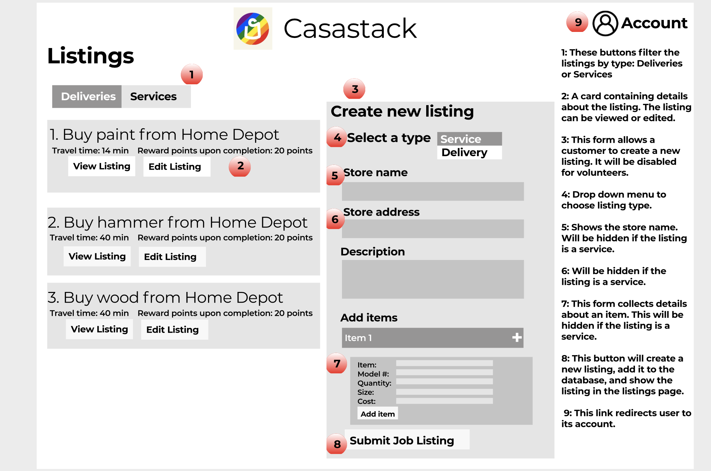
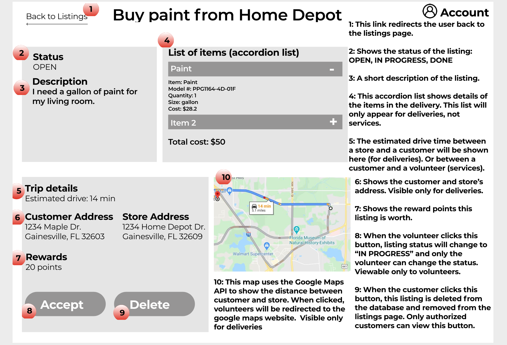
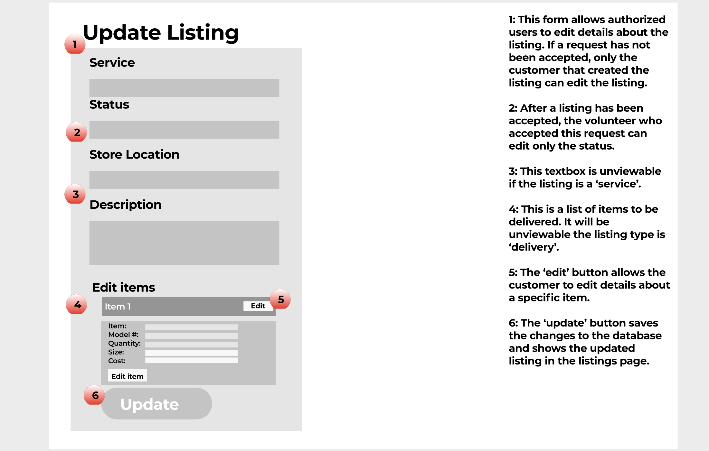
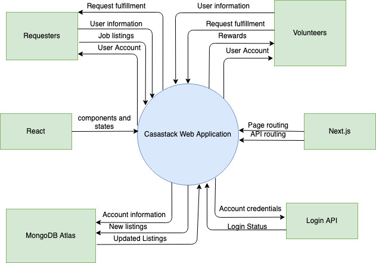
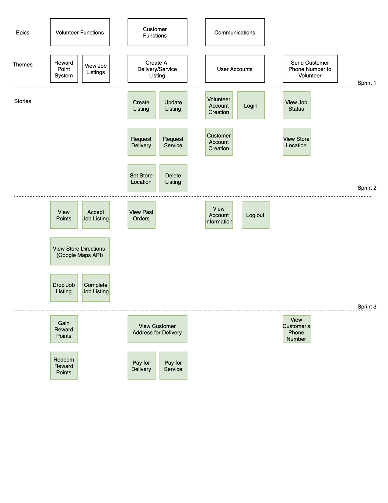

## Casastack Read Me 

Casastack is a web application used to allow for the remote delivery of hardware and tools to customers that do not wish to go out themselves. Additionally, customers can request services such as hanging a painting or mirror.

When loading the website, users are given the option to create a customer or volunteer account.

Customer accounts will be given the ability to create a listing (delivery or service) for volunteers to accept and complete.

Volunteer accounts will be able to accept job listings that they wish to complete. Additionally, volunteers are given the incentive to complete such requests for customers through rewards that are handed out at the Clients wish (Either once a month or whatever the client deems reasonable).

## Casastack Wireframe







## Casastack System Context Model


## User Storyboard


## Requested Features
### User Accounts
Customer and volunteer accounts need to allow for customers to create listings and for volunteers to accept and complete listings.

### Listings
Listings must be created for volunteers to accept (either deliveries or services). These listings must be connected in a database with the option for the customer to edit or delete the listing.

### Listing Filters
Listings must have a filter feature so that volunteers can better choose which listing they prefer.

### Map
When viewing a listings as a volunteer, a map must be displayed that allows the volunteer to get directions to the customer's location.

### Payment Feature
The customer must be able to pay the volunteer for the items that they must deliver, as well as the service that they are asking them to complete. This payment must be done before the volunteer purchases the items for delivery to ensure they have enough money to pay for the items.

### Volunteer Rewards
Volunteers must have an incentive to complete listings. Rewards will allow for volunteers to receive payment other than tips for completing jobs. Rewards must be created from the website UI and not hardcoded.

## Requirements
You will need to create accounts and get API keys for the following web services:
Mongo DB Atlas
Google API's
Stripe Payment Platform
Geocode Service
Fixie

After creating accounts and API keys, place each into one env file like so, replacing <key> with each individual API key:
```bash
MONGO_URI=<key>
JWT_SECRET=<key>
MAPS_API_KEY=<key>
GEOCODE_API_KEY=<key>
STRIPE_KEY=<key>
REACT_CHECKOUT_KEY=<key>
FIXIE_URL =<key>
```

To get started, type
```bash
$npm i
```
This will install all of the dependencies that the web app will use.


## Setting up the server

To start the server on a local host in development mode, run the following:
```bash
$npm run dev
```
Now type in your browser "localhost:3000"
This will open the web app in your browser and full functionality is enabled for users to test.

To run the server in production mode, first you will need to run:
```bash
$npm run build
```
This creates a production build that will allow for users to start the server by typing the following:
```bash
$npm run start
```
After typing in your browser "localhost:3000"
The production version of Casastack will be enabled for use.

## Stopping the server

To end the server, click the control + c buttons in your console.
